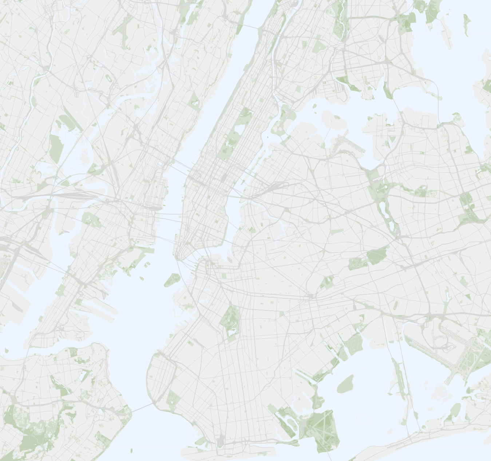
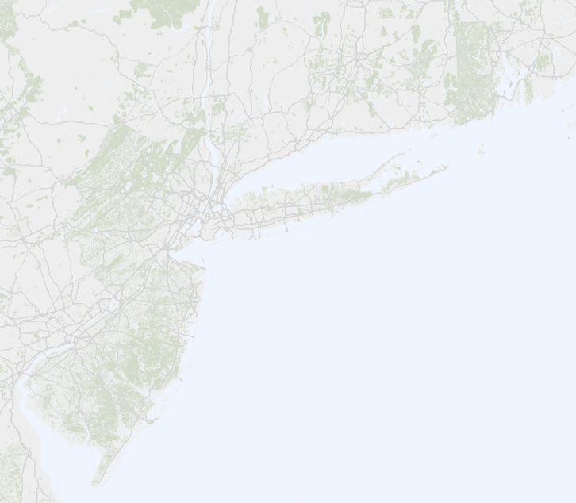
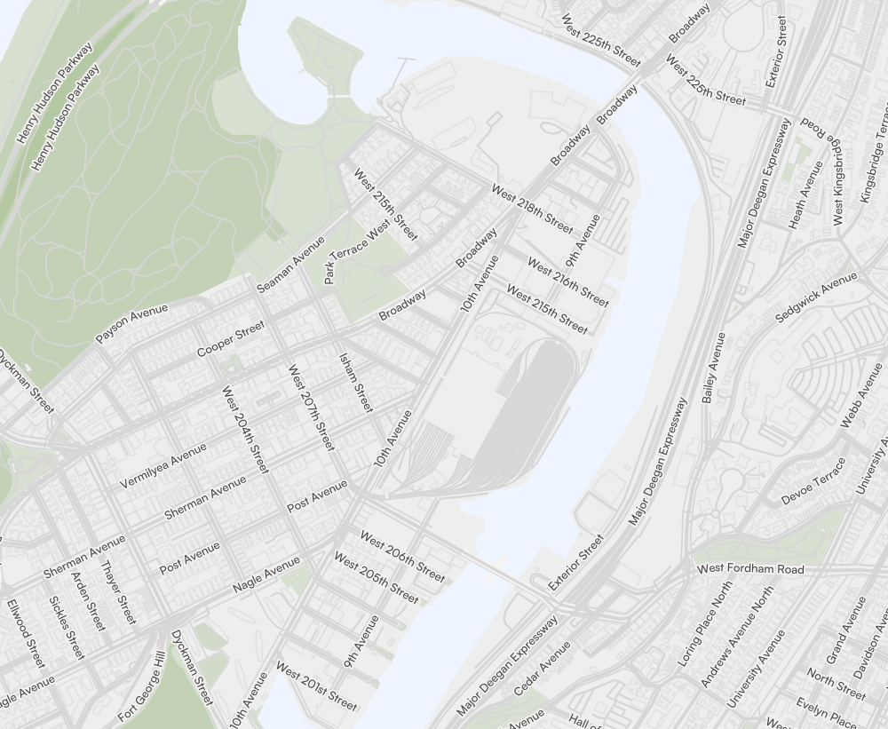

# OSM-MVT-QGIS-Basemap-Style-

A simple OpenStreetMap (OSM) vector tile basemap style for QGIS.  
Created for Day 14 of the [30DayMapChallenge](https://30daymapchallenge.com/) in 2025.

This repository includes a QGIS layer definition file (`.qlr`) that you can load directly into QGIS to apply the custom styling.

## About the Vector Tiles

The style uses OSM Mapbox Vector Tiles served publicly at: https://vector.openstreetmap.org/shortbread_v1/{z}/{x}/{y}.mvt

To learn more about OSM vector tiles, see the OpenStreetMap community post at [this link](https://community.openstreetmap.org/t/vector-tiles-on-osmf-hardware/121501/1) and an overview with key concepts at the OSM Wiki at [this link](https://wiki.openstreetmap.org/wiki/Vector_tiles)

## About the Style

- Designed as a clean basemap, primarily for maps of urban areas.
- Uses the Satoshi font family for street labels.
- Adjusts symbology and feature visibility based on zoom levels.
    

This style builds on “OpenStreetMap MVT – Simple Example” published by Klas Karlsson on the QGIS Hub:  
[Linked here.](https://hub.qgis.org/layerdefinitions/4/)

Klas Karlsson’s walkthrough video was especially helpful during development. If you would like to modify this style file and are not sure how, his video is a great starting place. [Here's a link.](https://www.youtube.com/watch?v=RF4-Ddoti9A)

## How to Use

1. Download the .qlr file from this repository.
2. In QGIS, drag the file into your Layers panel.
3. The layer will load via the OSM vector tile source noted above and all styling applied.

## Examples

